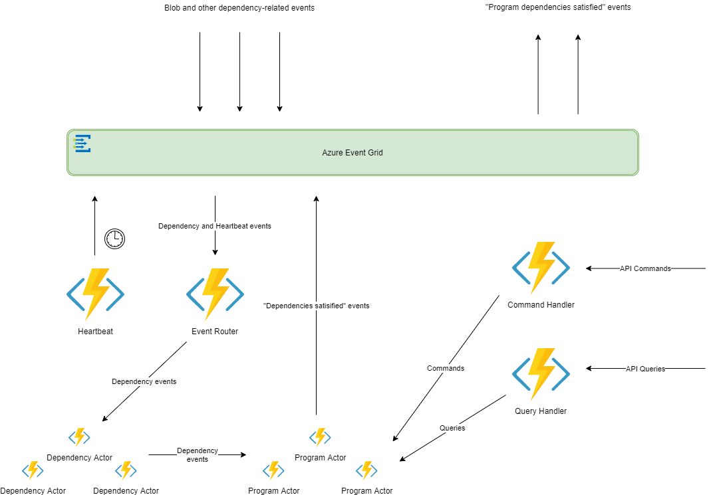

# DDR Actor Model Sample

DDR sample written in Javascript, supports multiple programs with file-based dependencies, as defined [here](ProgramDependencyMapping.js).

Individual programs are represented as actors that keep track of their own state, using the [durable entities](https://docs.microsoft.com/en-us/azure/azure-functions/durable/durable-functions-entities) feature of [Azure Durable Functions 2.0](https://docs.microsoft.com/en-us/azure/azure-functions/durable/durable-functions-versions). Dependencies are represented as Azure Event Grid events.

## Prerequisites
- [Visual Studio Code](https://code.visualstudio.com/) (other editors may work but haven't been tested)
- [Azure Functions Core Tools](https://docs.microsoft.com/en-us/azure/azure-functions/functions-run-local)
- [.NET Core 2.x SDK](https://dotnet.microsoft.com/download/dotnet-core/2.2) (note this is only for the Az Funcs Core Tools... no application code is written in .NET)
- Install the durable functions binding extension:

    `func extensions install --package Microsoft.Azure.WebJobs.Extensions.DurableTask --version 2.1.0`

- [VS Code Azure Functions extension](https://marketplace.visualstudio.com/items?itemName=ms-azuretools.vscode-azurefunctions)
- [Node.js](https://nodejs.org/en/)
- An existing Azure resource group and storage account within the RG

## To run locally
1. Edit [create-program-topic-and-sub.sh](create-program-topic-and-sub.sh) to include details of your environment (Azure sub ID, storage account, resource group, etc.) and then run the script to create an event grid topic and subscription for programs to post when dependencies are satisfied. Note the EG topic and key output on the command line
1. Create a local.settings.json file from [local.settings.json.template](local.settings.json.template) and update the program topic key and endpoint values with those from the previous step
1. _(you can ignore heartbeat topic key/endpoint for local debugging)_
1. Modify [ProgramDependencyMapping.js](ProgramDependencyMapping.js) to reflect desired programs and dependent files. Note that mappings are defined bi-directionally
1. Run the Function app inside the VS Code debugger, and use the [sample Postman requests](DDR.postman_collection.json) to interact with it
    - **FileEvent**: simulates a "blob created" event as a program dependency
    - **HeartbeatEvent**: simulates the timer heartbeat used for injecting the element of time into actor processing; you typically do not need to fire these events manually
    - **ResetProgram**: re-initializes a program actor to its default state
    - **ManualInvokeProgram**: immediately causes the target program to fire its "dependencies satisfied" event (regardless of its current state) and then resets its state to default
    - **EnableProgram**: ensures the 'enabled' flag for a given program is set to True
    - **DisableProgram**: ensures the 'enabled' flag for a given program is set to False
    - **QueryProgramState**: returns the dependency state for a program
1. DEBUGGING TIP: [View events](https://docs.microsoft.com/en-us/azure/storage/queues/storage-quickstart-queues-portal#view-message-properties) emitted for programs with satisfied dependencies in the queue created in the first step above
